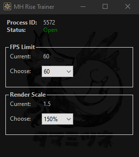
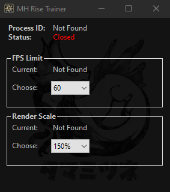

# Monster Hunter Trainer
Trainer for the game Monster Hunter that lets you unlock framerates on custscenes and go over the limit of 150% of render scale.

## Memory Address Values
This trainer was possible because of the Cheat Engine tool that let us watch memory values. This also means that any game update that changes the route to the previously correct memory address will break this application.

## INI File
Since game updates might break the application, there's a INI file that will be updated instead of rebuilding the whole application only to fix this simple change.

## Screenshots

